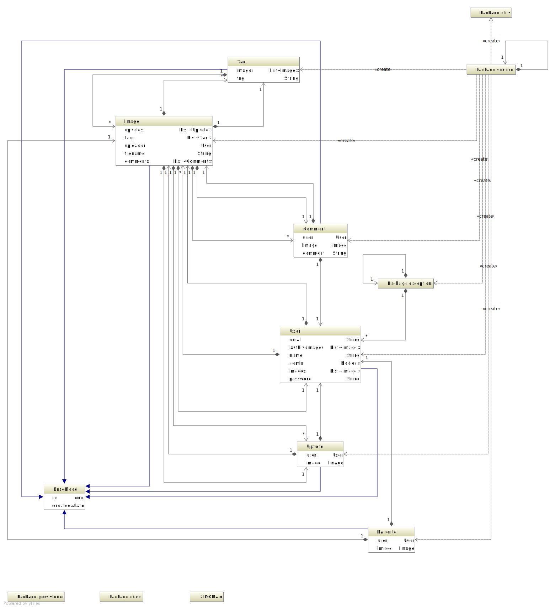

# ZIMG
An image application for HS-Bremen

##Development

### Set up Vagrant 

1. Install Vagrant and VirtualBox
2. execute 'vagrant destroy && vagrant up'
3. set up mysql connection (localhost:3306; user: dbUser; password: dbPass; db:zimg)

http://www.sivalabs.in/2014/03/springmvc4-spring-data-jpa.html

### Set up gradle 
1. Download gradle wrapper 
2. Use the 'jettyRun' task to start the server 

##Screenshots

##Structure
The following diagrams show you the structure of the application. 

###Models-Class-Diagramm 

###Services-Class-Diagramm 

